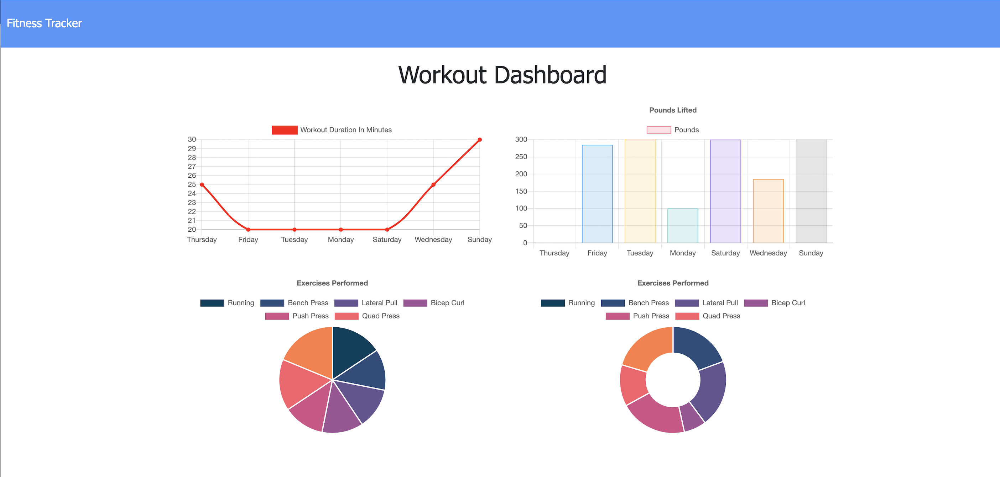

 
# 
**I Work Out** 

## 
Table of Contents:

* [Description](#description)
* [Technologies](#technologies)
* [Usage](#usage)
* [Visuals](#visuals)
* [Testing](#testing)
* [Contributing](#contributing)
* [Questions](#questions)
* [License](#license)

## 
 <a name="description"> **Description** :</a>
 

Built upon existing code to create an app where a user is be able to view, create, and track daily workouts. The user can log multiple exercises in a workout on a given dayand can track the name, type, weight, sets, reps, and duration of exercise. If the exercise is a cardio exercise, the user can my distance traveled.
A user will reach their fitness goals quicker when able to track workout progress.

## 
 <a name="technologies"> **Technologies** :</a>
 

### HTML
### Mongoose
### Mongo DB
### Express
### Atlas
### Heroku

## 
<a name="usage"> **Usage** :</a>

When the user loads the page, the user is given the option to create a new workout or continue with the last workout.

The user can:

  * Add exercises to the most recent workout plan.
  
  * View the total duration of the last workout.

  * Add new exercises to a new workout plan.

  * View the combined weight of multiple exercises from the past seven workouts on the stats page.

  * View the total duration of each workout from the past seven workouts on the stats page.

 
 

## 
 **The Deployed site :**

### https://i-work-out.herokuapp.com/

## 
<a name="visuals"> **Visuals** :</a>

This is the completed site:

Here is the site in action:

## 
<a name="testing"> **Testing** :</a>

N/A

## 
<a name="contributing"> **Contributing** :</a>

Pull requests are always welcome.  When contributing to this repository, please first discuss the change you wish to make via email or issue.  
After approval, please follow the "fork-and-pull" Git workflow.
<ol>
<li>Fork the repo on GitHub</li>
<li>Clone the project to your own machine</li>
<li>Commit changes to your own branch</li>
<li>Push your work back up to your fork</li>
<li>Submit a Pull request so that we can review your changes</li>
</ol>

## 
<a name="questions"> **Questions** :</a>

If you have any questions, feel free to reach out to me.   My email is ckhilpisch@gmail.com.

## 
 <a name="license"> **License** : 
 

MIT License
Informataion avaiable here: 
https://opensource.org/licenses/MIT

